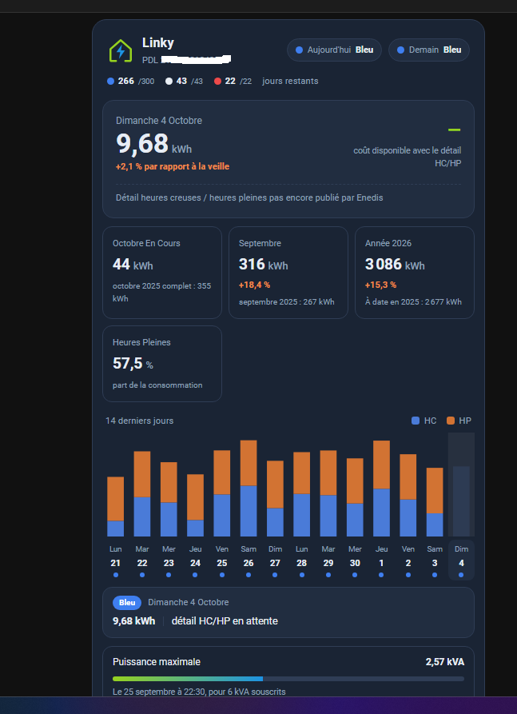

# Carte Enedis V2

[](https://buymeacoffee.com/marlboro62) [](https://ko-fi.com/nothing_one)

Carte Lovelace pour **[MyElectricalData v2](https://github.com/MyElectricalData/myelectricaldata_new)** (mode client) : consommation Linky, heures creuses / heures pleines, Tempo, coût estimé et puissance maximale, dans le style de l'interface v2.



Elle reprend l'esprit de [content-card-linky](https://github.com/MyElectricalData/content-card-linky), réécrite pour les entités publiées par l'export Home Assistant de la v2. Pour l'add-on MyElectricalData **v1**, utilisez content-card-linky.

## Ce qu'affiche la carte

- la couleur Tempo d'aujourd'hui et de demain, et les jours restants par couleur ;
- la consommation de la veille, son évolution, le coût estimé et la répartition HC / HP ;
- le mois en cours, le mois dernier, l'année en cours et la part d'heures pleines ;
- un graphique des 7, 14 ou 31 derniers jours (HC et HP empilés, jours colorés selon Tempo) ; un clic sur un jour affiche son détail ;
- la puissance maximale de la période, comparée à la puissance souscrite ;
- EcoWatt, uniquement quand des données sont disponibles.

Les données pas encore publiées par Enedis sont signalées comme telles, au lieu d'afficher `-1`.

## Prérequis

- MyElectricalData v2 en mode client (Docker ou [add-on Home Assistant](https://github.com/Marlboro62/hassio-addons)) ;
- l'export **Home Assistant** activé dans l'interface MyElectricalData (page Home Assistant : URL de Home Assistant et jeton d'accès longue durée).

L'export crée notamment `sensor.linky_<pdl>_consumption`, `sensor.rte_tempo_today`, `sensor.rte_tempo_tomorrow`, `sensor.edf_tempo_tempo_info` et les prix `sensor.edf_tempo_price_*`.

## Installation

### Avec HACS

1. HACS, menu ⋮, **Dépôts personnalisés**.
2. Ajoutez `https://github.com/Marlboro62/content-card-linky-v2`, catégorie **Tableau de bord** (Dashboard).
3. Installez **Carte Enedis V2**, puis rechargez la page (Ctrl+F5).

### Manuellement

1. Copiez `content-card-linky-v2.js` dans `/config/www/`.
2. **Paramètres → Tableaux de bord → ⋮ → Ressources → Ajouter** : URL `/local/content-card-linky-v2.js?v=0.2.1`, type **Module JavaScript**.
3. Rechargez la page (Ctrl+F5). Changez le `?v=` à chaque mise à jour du fichier.

## Configuration

La carte se configure avec l'éditeur visuel, ou en YAML :

```yaml
type: custom:content-card-linky-v2
entity: sensor.linky_<pdl>_consumption
days: 14
subscribed_power: 6
theme: v2
```

| Option | Défaut | Description |
|---|---|---|
| `entity` | obligatoire | Capteur de consommation `sensor.linky_<pdl>_consumption` |
| `title` | `Linky` | Titre affiché |
| `days` | `14` | Historique du graphique : `7`, `14` ou `31` jours |
| `subscribed_power` | aucun | Puissance souscrite en kVA, pour la jauge de puissance maximale |
| `theme` | `v2` | `v2` : style bleu nuit de MyElectricalData v2 ; `ha` : suit le thème clair ou sombre de Home Assistant |
| `show_cost` | `true` | Afficher les coûts estimés |
| `show_pdl` | `true` | Afficher le numéro de PDL sous le titre |
| `tempo_today` | `sensor.rte_tempo_today` | Couleur Tempo du jour |
| `tempo_tomorrow` | `sensor.rte_tempo_tomorrow` | Couleur Tempo du lendemain |
| `tempo_info` | `sensor.edf_tempo_tempo_info` | Jours Tempo restants |
| `ecowatt` | `sensor.rte_ecowatt_j0` | Signal EcoWatt (bloc masqué si indisponible) |
| `price_prefix` | `sensor.edf_tempo_price_` | Préfixe des capteurs de prix Tempo |

## À savoir

- **Coût estimé** : calculé par la carte (HC et HP du jour multipliés par le prix Tempo de la couleur du jour), hors abonnement. Les heures creuses de 0 h à 6 h appartiennent en réalité au jour Tempo de la veille : l'estimation peut donc légèrement différer de la facture.
- **Jours Tempo restants** : calculés à partir du quota et des jours utilisés.
- **Cumuls annuels** : calculés par MyElectricalData en année civile.

## Licence

MIT. Merci à [saniho](https://github.com/saniho/content-card-linky) et à l'équipe [MyElectricalData](https://github.com/MyElectricalData) pour content-card-linky, dont cette carte s'inspire.
